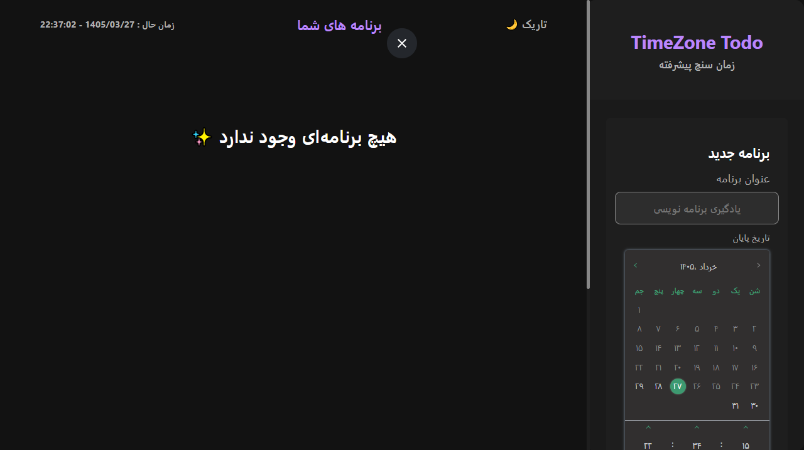

<<<<<<< HEAD
# 🕐 TimeZone Todo App

A full-stack todo application with Persian (Jalali) calendar support and advanced time management features.



## ✨ Features

- ✅ CRUD operations for todos
- 📅 Persian (Jalali) calendar date picker
- ⏰ Advanced timer for tasks
- 🎯 Deadline management
- 📱 Responsive design
- 🔄 Real-time updates
- 🌐 Persian language support

## 🛠️ Tech Stack

### Frontend
- **React 18** with Hooks
- **Vite** for fast builds
- **CSS Modules** / Tailwind CSS
- **Axios** for API calls
- **ESLint** for code quality

### Backend
- **Flask** (Python)
- **SQLAlchemy** ORM
- **SQLite** database
- **Flask-CORS** for cross-origin requests

## 🚀 Quick Start

### Prerequisites
- Python 3.8+
- Node.js 16+
- npm or yarn

### Backend Setup

```bash
cd backend
python -m venv venv
# On Windows:
venv\Scripts\activate
# On Mac/Linux:
source venv/bin/activate

pip install -r requirements.txt
python app.py
=======
# TodoApp
Full-stack Todo App with React + Flask featuring Persian (Jalali) calendar, advanced timer, and responsive design. Built with modern development practices, RESTful API, and clean architecture.
>>>>>>> db253d8e0fc56a8d7083444d31f3bf803987e34e
